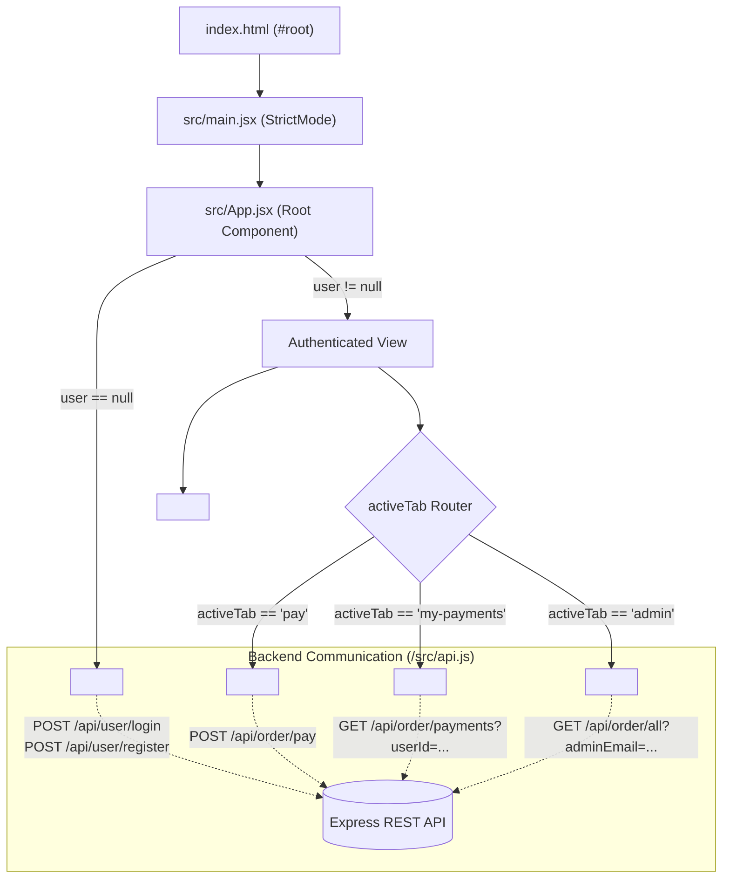

# 💻 Assignment Pay - Frontend Application Deep Dive

[](https://react.dev/)
[](https://vitejs.dev/)
[](https://developer.mozilla.org/)
[](https://www.w3.org/TR/CSS/)
[](https://eslint.org/)

This document provides a comprehensive, component-by-component, and architectural breakdown of the **Assignment Pay** frontend client. It covers state management, UI component trees, styling architecture, API interactions, and development workflows.

---

## 📑 Table of Contents

- [Architectural Overview](#-architectural-overview)
- [Component Hierarchy & Data Flow](#-component-hierarchy--data-flow)
- [Application State & Session Management](#-application-state--session-management)
- [In-Depth Component Breakdown](#-in-depth-component-breakdown)
  - [1. App.jsx (Root Controller)](#1-appjsx-root-controller)
  - [2. Navbar.jsx (Header & Navigation)](#2-navbarjsx-header--navigation)
  - [3. AuthPage.jsx (Authentication Portal)](#3-authpagejsx-authentication-portal)
  - [4. PayPage.jsx (Payment Processing)](#4-paypagejsx-payment-processing)
  - [5. MyPaymentsPage.jsx (Personal Order History)](#5-mypaymentspagejsx-personal-order-history)
  - [6. AdminPanel.jsx (Analytics & Management)](#6-adminpaneljsx-analytics--management)
- [API Layer & Configuration (api.js)](#-api-layer--configuration-apijs)
- [Design System & CSS Architecture (App.css)](#-design-system--css-architecture-appcss)
- [Public Assets & Static Resources](#-public-assets--static-resources)
- [Component Props & State Reference](#-component-props--state-reference)
- [Developer Workflow & Scripts](#-developer-workflow--scripts)
- [User Interaction Flows](#-user-interaction-flows)
- [Troubleshooting & FAQs](#-troubleshooting--faqs)

---

## 🏗 Architectural Overview

The frontend is constructed as a **Single Page Application (SPA)** using **React 19** and bundled with **Vite 8**. It adheres to a component-driven architecture with centralized session synchronization through browser `localStorage`.

### Key Design Principles:
- **Zero External UI Bloat**: Built purely with idiomatic React and responsive native CSS3 (no heavy UI libraries like Tailwind, MUI, or Bootstrap).
- **Fast Startup & Hot Module Replacement (HMR)**: Powered by Vite's native ES module serving.
- **Role-Gated Views**: Navigation tabs and administrative screens automatically adapt according to the authenticated user's role and email.
- **Fault-Tolerant Client State**: Seamless recovery across page refreshes using persistent storage with fallback error handlers.

---

## 🌲 Component Hierarchy & Data Flow



---

## 💾 Application State & Session Management

Session data is managed within [`App.jsx`](file:///c:/Users/satya/OneDrive/Desktop/Project/Assignment/Frontend/src/App.jsx) and synchronized directly with the browser's `localStorage` under the key `'assignment_user'`.

### User Object Schema
```typescript
interface User {
  id: string;        // MongoDB ObjectId
  name: string;      // User's full name
  email: string;     // Normalized lowercase email address
  role: 'user' | 'admin'; // Authorization tier
}
```

### State Synchronization Lifecycle
1. **App Mount**: `useState` initializes by reading `'assignment_user'` from `localStorage`. If JSON parsing fails or the key is absent, it safely initializes to `null`.
2. **Login / Register**: `handleLogin(userData)` stores the payload in React state and writes the serialized JSON string to `localStorage`.
3. **Logout**: `handleLogout()` clears state to `null`, removes `'assignment_user'` from `localStorage`, and resets the active tab back to `'pay'`.

---

## 🔍 In-Depth Component Breakdown

### 1. `App.jsx` (Root Controller)
- **Path**: [`src/App.jsx`](file:///c:/Users/satya/OneDrive/Desktop/Project/Assignment/Frontend/src/App.jsx)
- **Responsibilities**:
  - Serves as the root orchestrator.
  - Implements the top-level authentication guard: if `user === null`, renders `<AuthPage />`, otherwise renders the authenticated layout.
  - Controls tab routing via the `activeTab` state (`'pay'` | `'my-payments'` | `'admin'`).
  - Provides callbacks (`onLogin`, `onLogout`) down to child components.

---

### 2. `Navbar.jsx` (Header & Navigation)
- **Path**: [`src/components/Navbar.jsx`](file:///c:/Users/satya/OneDrive/Desktop/Project/Assignment/Frontend/src/components/Navbar.jsx)
- **Props**:
  - `activeTab` *(string)*: Current tab identifier.
  - `setActiveTab` *(function)*: Tab switching callback.
  - `user` *(object)*: Current user object.
  - `onLogout` *(function)*: Logout trigger.
- **Key Behaviors**:
  - **Dynamic Admin Tab**: Checks `user?.email?.toLowerCase() === ADMIN_EMAIL`. If true, displays a specialized gold-bordered `"Admin Panel"` navigation tab.
  - **Role Badge**: Injects an `<span className="badge-admin">Admin</span>` tag next to the user's name when an admin profile is active.
  - **Brand Navigation**: Clicking `"Assignment Pay"` navigates directly back to the `'pay'` tab.
  - **Clean Logout**: Dedicated `"Sign out"` button with hover states.

---

### 3. `AuthPage.jsx` (Authentication Portal)
- **Path**: [`src/components/AuthPage.jsx`](file:///c:/Users/satya/OneDrive/Desktop/Project/Assignment/Frontend/src/components/AuthPage.jsx)
- **Props**:
  - `onLogin` *(function)*: Callback invoked with user payload upon successful authentication.
- **Key Features**:
  - **Dual-Mode Toggle**: Single view toggling between **Sign In** and **Create an Account** (Register) without page reloads.
  - **Form Validation**: Validates full name (for registration), email format, and password fields.
  - **Demo Admin Autofill**: Includes an **"Autofill (satyam@gmail.com)"** button. One click switches to Sign In mode and instantly fills the administrative email (`satyam@gmail.com`) and default password (`Satyam@62`) for quick reviewer evaluation.
  - **API Integration**:
    - Sign In &rarr; `POST ${API_URL}/api/user/login`
    - Register &rarr; `POST ${API_URL}/api/user/register`
  - **Feedback Notifications**: Displays descriptive error and loading alerts inline.

---

### 4. `PayPage.jsx` (Payment Processing)
- **Path**: [`src/components/PayPage.jsx`](file:///c:/Users/satya/OneDrive/Desktop/Project/Assignment/Frontend/src/components/PayPage.jsx)
- **Props**:
  - `user` *(object)*: Active user session data.
- **Key Features**:
  - **Quick Amount Presets**: Provides clickable badge buttons for standard amounts: **\$20**, **\$50**, **\$60**, and **\$100**. Clicking any preset updates the active selection and the input field.
  - **Custom Amount Input**: Number input with `min="1"` and `step="any"` allowing arbitrary decimal currency inputs.
  - **Payment Dispatch**: Submits a POST payload to `${API_URL}/api/order/pay`:
    ```json
    {
      "userId": "...",
      "userName": "...",
      "amount": 50,
      "currency": "usd"
    }
    ```
  - **Transaction Feedback**: Shows instant success feedback with recorded amounts or detailed error alerts if connection drops or inputs are invalid.
  - **Button State Management**: Changes submit button text dynamically to `"Processing..."` and disables click interactions during inflight requests.

---

### 5. `MyPaymentsPage.jsx` (Personal Order History)
- **Path**: [`src/components/MyPaymentsPage.jsx`](file:///c:/Users/satya/OneDrive/Desktop/Project/Assignment/Frontend/src/components/MyPaymentsPage.jsx)
- **Props**:
  - `user` *(object)*: Current user context (`user.id`).
- **Key Features**:
  - **Lifecycle Querying**: Triggered automatically on component mount and whenever `user.id` changes.
  - **Endpoint**: `GET ${API_URL}/api/order/payments?userId=${user.id}`.
  - **Data Display**:
    - **Date**: Formatted via `toLocaleDateString()`.
    - **Amount**: Bold currency notation (`$X`).
    - **Status Badge**: Context-aware color styling (`paid`, `pending`, `failed`, `completed`).
    - **Transaction ID**: Monospaced code block displaying the MongoDB `_id`.
  - **Empty & Loading States**: Clean indicators for `"Loading..."` or `"No payments found."`.
  - **Manual Refresh**: Includes a `"Refresh"` button in the card header for on-demand synchronization.

---

### 6. `AdminPanel.jsx` (Analytics & Management)
- **Path**: [`src/components/AdminPanel.jsx`](file:///c:/Users/satya/OneDrive/Desktop/Project/Assignment/Frontend/src/components/AdminPanel.jsx)
- **Props**:
  - `user` *(object)*: Logged-in administrator profile.
- **Key Features**:
  - **Access Gate**: Immediately renders an `"Access Denied"` card if `user.email` does not match `ADMIN_EMAIL`.
  - **Administrative Fetching**: Calls `GET ${API_URL}/api/order/all?adminEmail=...` with the `x-admin-email` request header.
  - **Real-Time KPI Metrics**:
    - **Total Revenue**: Accrues amounts for all transactions marked as `'paid'` or `'completed'`:
      ```javascript
      const totalRev = payments
        .filter((p) => p.status === 'paid' || p.status === 'completed')
        .reduce((sum, p) => sum + (Number(p.amount) || 0), 0)
      ```
    - **Total Transactions**: Total array count of platform records.
  - **Live Filter / Search**: Case-insensitive instant filtering across:
    - Customer Name (`userName`)
    - Customer User ID (`userId`)
    - Payment Record ID (`_id`)
  - **Comprehensive Transaction Table**: Columns for Date, User Name, User ID, Amount, Status Badge, and Transaction ID.

---

## 🌐 API Layer & Configuration (`api.js`)

Central configuration module located at [`src/api.js`](file:///c:/Users/satya/OneDrive/Desktop/Project/Assignment/Frontend/src/api.js):

```javascript
export const API_URL = import.meta.env.VITE_API_URL || 'http://localhost:8000'
export const ADMIN_EMAIL = import.meta.env.VITE_ADMIN_EMAIL || 'satyam@gmail.com'
```

### Variables Explained
| Variable | Fallback Default | Description |
| :--- | :--- | :--- |
| `VITE_API_URL` | `http://localhost:8000` | Backend API root URL consumed by all `fetch` requests |
| `VITE_ADMIN_EMAIL` | `satyam@gmail.com` | Email recognized by UI for unlocking admin tabs and panels |

---

## 🎨 Design System & CSS Architecture (`App.css`)

All styling is managed cleanly in [`src/App.css`](file:///c:/Users/satya/OneDrive/Desktop/Project/Assignment/Frontend/src/App.css).

### Visual Tokens & Color Palette
- **Canvas Background**: `#f3f4f6` (Soft neutral gray)
- **Card Background**: `#ffffff` (Pure white with subtle border `#e5e7eb` and drop shadow)
- **Primary Text**: `#111827` (Deep slate)
- **Secondary / Subtitle Text**: `#6b7280` (Muted gray)
- **Primary Buttons & Active Tabs**: `#1e293b` (Dark charcoal)
- **Admin Accents**: `#b45309` / `#fef3c7` (Warm amber)
- **Status Colors**:
  - `paid` / `completed` / `success`: Background `#dcfce7`, text `#166534` (Emerald green)
  - `pending`: Background `#fef9c3`, text `#854d0e` (Amber yellow)
  - `failed` / `error`: Background `#fee2e2`, text `#991b1b` (Crimson red)

### Responsive Layout Strategy
- **Card Containers**: Fixed max-widths (`440px` for standard payment/auth cards; `800px` for `.card-wide` tables).
- **Preset Grid**: 4-column responsive grid (`grid-template-columns: repeat(4, 1fr)`).
- **Stats Row**: 2-column KPI metric display (`grid-template-columns: 1fr 1fr`).
- **Data Tables**: Striped table with sticky borders, hover backgrounds, and inline monospace identifiers.

---

## 📦 Public Assets & Static Resources

```text
Frontend/
├── public/
│   ├── favicon.svg      # Vector SVG favicon for browser tab
│   ├── icons.svg        # Scalable application iconography
│   └── images.png       # High-resolution raster brand mark
└── src/
    └── assets/
        ├── hero.png     # Graphic asset for presentation
        ├── react.svg    # Official React framework logo
        └── vite.svg     # Official Vite logo
```

---

## 📋 Component Props & State Reference

| Component | Props Accepted | Internal State | Backend Endpoint Triggered |
| :--- | :--- | :--- | :--- |
| `<App />` | None | `user`, `activeTab` | None (reads/writes `localStorage`) |
| `<Navbar />` | `activeTab`, `setActiveTab`, `user`, `onLogout` | Derived: `isAdmin` | None |
| `<AuthPage />` | `onLogin(userData)` | `isRegister`, `form`, `status`, `loading` | `POST /api/user/login`<br/>`POST /api/user/register` |
| `<PayPage />` | `user` | `amount`, `loading`, `status` | `POST /api/order/pay` |
| `<MyPaymentsPage />`| `user` | `payments`, `loading`, `error` | `GET /api/order/payments?userId=...` |
| `<AdminPanel />` | `user` | `payments`, `loading`, `error`, `search` | `GET /api/order/all?adminEmail=...` |

---

## 🛠 Developer Workflow & Scripts

All commands are executed from the `Frontend` directory:

### 1. Development Mode (with HMR)
```bash
npm run dev
```
Starts the local development server at `http://localhost:5173`. Hot module replacement updates components instantaneously without losing state.

### 2. Production Build
```bash
npm run build
```
Compiles and bundles JSX and assets into the highly optimized static folder `dist/`.

### 3. Build Preview
```bash
npm run preview
```
Runs a local web server serving the compiled `dist/` production build to verify bundle performance and routing.

### 4. Code Quality & Linting
```bash
npm run lint
```
Executes ESLint across all `.js`, `.jsx` files checking for syntax errors, unused variables, and React Hooks dependency rule violations.

---

## 🔄 User Interaction Flows

### Flow 1: Authentication & Demo Login
```text
[User Opens App]
       │
       ▼
[AuthPage Rendered]
       │
       ├─► Option A: Fill Name, Email, Password -> Click "Register"
       │
       ├─► Option B: Click "Autofill (satyam@gmail.com)" -> Click "Sign In"
       │
       ▼
[Backend Validates & Issues JWT]
       │
       ▼
[App saves user to localStorage & switches to Navbar + PayPage]
```

### Flow 2: Making a Payment
```text
[User on PayPage]
       │
       ├─► Click preset ($20 / $50 / $60 / $100) OR enter custom amount
       │
       ▼
[Click "Pay $X"]
       │
       ▼ (Button switches to "Processing...")
[POST to /api/order/pay]
       │
       ▼
[Success alert displayed: "Payment of $X successful! Recorded in database."]
```

### Flow 3: Viewing & Searching in Admin Panel
```text
[Admin logs in as satyam@gmail.com]
       │
       ▼
[Navbar highlights "Admin Panel" tab]
       │
       ▼
[AdminPanel loads all transactions]
       │
       ├─► View Total Revenue and Total Transaction count
       │
       └─► Type in Search Bar -> Instant table filter by name, userId, or paymentId
```

---

## ❓ Troubleshooting & FAQs

### 1. Getting `"Cannot connect to backend server"`
- Ensure the backend Node server is running on `http://localhost:8000`.
- Verify that `Frontend/.env` contains `VITE_API_URL=http://localhost:8000`.
- If running on a different port, update both `Frontend/.env` and the CORS configuration in `Backend/server.js`.

### 2. Admin Panel tab is not visible in the Navbar
- Confirm you are logged in with the email `satyam@gmail.com`.
- Verify `VITE_ADMIN_EMAIL` in `Frontend/.env` matches `satyam@gmail.com`.
- You can use the **Autofill** button on the sign-in page to ensure exact case and spelling.

### 3. Session lost after closing browser
- The app utilizes `localStorage.setItem('assignment_user', ...)`. Ensure your browser does not have storage disabled or in private browsing settings that clear storage immediately.

---

## 🔗 Related Documentation
- 📖 [System Root Documentation (Architecture, Backend APIs, Stripe)](../README.md)
